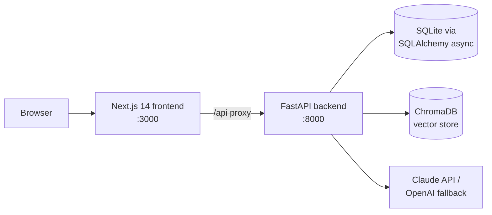

# InfluMatch AI

**An AI-powered B2B marketplace that connects merchants with influencers, content creators, and creative strategists in the Jordanian market.**

Merchants launch campaigns, discover the best-fit creators through AI matching, book collaborations, sign contracts, and pay through escrow. Creators manage bookings, portfolios, and earnings from their own dashboards. The interface supports Arabic (RTL) and English.


---

## Features

| Area | What it does |
|---|---|
| **AI matching** | Scores influencers against a campaign on category, audience, language, and platform fit, backed by a ChromaDB vector store with `all-MiniLM-L6-v2` embeddings |
| **AI assistant** | Generates campaign briefs and powers an onboarding chat using Anthropic Claude, with OpenAI as a fallback |
| **Campaigns & bookings** | Full booking lifecycle between merchants and creators, from request to delivery |
| **Escrow & wallet** | Funds are held in escrow and released on completion, with a platform wallet and loyalty points (Stripe-style payment simulation) |
| **Contracts** | Contract generation for agreed collaborations |
| **Messaging** | In-app messages between both sides of a deal |
| **Multi-role access** | Separate experiences for merchants, influencers, content creators, creative strategists, and admins |
| **Admin panel** | Platform-wide oversight of users, deals, and disputes |

## Architecture



- **Backend:** FastAPI, SQLAlchemy (async), Alembic, Pydantic, JWT auth (`python-jose`, `passlib`)
- **Frontend:** Next.js 14 (App Router), TypeScript, Tailwind CSS, Radix UI, Recharts
- **AI:** Anthropic Claude, OpenAI, LangChain, sentence-transformers, ChromaDB
- **Testing:** pytest (API) and Playwright (end-to-end)

## Project structure

```
app/                  FastAPI backend
├── routers/          REST endpoints (auth, campaigns, deals, escrow, wallet, contracts, ...)
├── services/         Business logic (matching, escrow, wallet, auth)
├── ai/               Claude client, embeddings, vector store
├── models/ schemas/  Database models and API schemas
└── main.py           App entry point, routes mounted under /api/v1
frontend_next/        Next.js frontend (App Router)
tests/                Backend test suite
migrations/           Alembic migrations
legacy/               Earlier Streamlit prototype (kept for reference)
```

## Getting started

**Requirements:** Python 3.11+, Node.js 18+

```bash
# 1. Configure environment variables
cp .env.example .env          # then add your ANTHROPIC_API_KEY and a SECRET_KEY

# 2. Backend (http://localhost:8000, API docs at /docs)
pip install -r requirements.txt
uvicorn app.main:app --reload --port 8000

# 3. Frontend (http://localhost:3000), in a second terminal
cd frontend_next
npm install
npm run dev
```

The database is created automatically on first start. The frontend proxies every `/api` request to the backend.

Shortcuts are available in the `Makefile`: `make backend`, `make frontend`, `make test`, and `make docker-up` (runs the backend in Docker).

## Tests

```bash
pytest                          # backend API tests
cd frontend_next && npx playwright test   # end-to-end tests
```

## Author

**Mohammad Albreim**, Data Science & AI
[LinkedIn](https://linkedin.com/in/albreim-ai-ds) · [GitHub](https://github.com/Mo7ammadosama)
